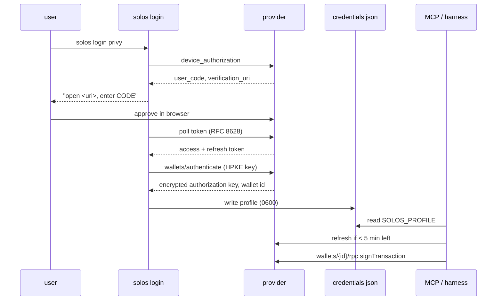

# Research: `solos login` and wallet providers

Date: 2026-09-16. Question: can solOS offer a pi-style login where a user picks a wallet provider,
completes a login, and the MCP server and harness then sign for them without hand-copied env vars?
Which providers allow that headless, and how hard is each?

Short answer: yes. Privy and Phantom offer a real login that ends in a signing credential. Every
other provider is "paste keys from a dashboard". pay.sh is not a signer. The local design work is
one small credential store, one provider-plugin interface copied from pi, and one new signer
adapter for the Privy OAuth path.

---

## 1. What the user wants, in the plan's terms

```text
solos login <provider>      human once, in a terminal, maybe a browser
        │
        ▼
~/.config/solos/credentials.json   (0600) or OS keychain, one entry per named profile
        │
        ├── MCP server (spawned by Claude Code / Codex / Cursor)   reads SOLOS_PROFILE
        └── harness daemon / agent run                              reads SOLOS_PROFILE
                │
                ▼
        KitSignerLive(profile) → Kit TransactionSigner → DirectSignerExecutor
```

Nothing in core changes. The signer seam (`KitSignerLive`) and the executor seam
(`ActionExecutor`) already exist. Login is a CLI feature plus a credential store plus per-provider
adapters behind `KitSignerLive`.

---

## 2. Providers

### 2.1 Privy — the best match

Two wallet models, both Solana-capable:

- **Server wallets.** Our app owns the wallet. Credential: `appId`, `appSecret`, `walletId`,
  optional P-256 authorization key. `@solana/keychain-privy` 1.4.0 supports this today
  (`createPrivySigner`). Headless. We would be the custodian on the user's behalf.
- **Embedded wallets with agent authorization.** The user owns the wallet. Our app is registered in
  Privy with "CLI and agent access" enabled and a hosted verification page. The CLI runs an OAuth 2.0
  **device-code** flow: it prints a code and URL, the user approves in a browser, Privy returns an
  access token (15 min) and a refresh token (30 days, rotated on every use). The CLI then gets an
  encrypted ephemeral authorization key and signs requests to `wallets/{id}/rpc` with it. Grants are
  listable and revocable by the user. This is the pi-style login.

Policy: Privy enforces rules in its TEE before signing. Solana rules cover program allow/deny lists,
SPL transfer destination and amount, system transfer recipient and lamports, plus m-of-n key quorums.
This is a real policy layer for wallet mode without putting one in solOS (ADR-0006 stays true).

Privy also ships an official MCP server (`@privy-io/mcp-server`, API-key only) and documents storing
tokens in the OS keychain, never in plain files.

Cost: free developer tier (50K signatures, under 499 monthly users), then 299 USD per month.

What we build: `solos login privy` (device flow), a `PrivyOAuthSigner` implementing Kit's
`TransactionPartialSigner` against the OAuth RPC endpoints (the keychain package only speaks the
server-wallet path), refresh on startup and near expiry.

**To verify with a real app:** the device-code documentation shows Ethereum examples only, so Solana
on that path needs a test. And whether the token exchange needs the app secret; if it does, the
exchange goes through a tiny backend next to the verification page and the MCP never holds it.

### 2.2 Para — dropped

No Para product logs an end user in from a terminal and yields a wallet-signing credential.
`para login` (in `@getpara/cli` 3.18) is a developer-portal OAuth for managing API keys; it cannot
sign. The REST API, the Para MCP server, and the agent skill all need a developer `sk_` secret and
only operate app-owned wallets, which stop being signable the moment a user claims them.

A no-paste flow is buildable but would be ours to host: a small page on `@getpara/react-sdk` where
the user logs in with email or passkey, then `waitAndExportSession()` hands the serialized session
(30 days max) to a localhost callback, and `@getpara/server-sdk` imports it to sign Solana through
`ParaSolanaWeb3Signer`. That is a hosted page, a web3.js dependency, and an undocumented server-side
login path to maintain. Decision 2026-09-16: not worth it while Privy provides the same UX natively.

### 2.3 pay.sh — a local wallet and a payment rail, not a signer

The `pay` CLI (0.28 installed here) creates a local Solana keypair (`pay setup`), stores the secret in
the macOS keychain or a file, records accounts in `~/.config/pay/accounts.yml`, funds it by QR from a
mobile wallet or by card onramp, and uses it to pay HTTP 402 / x402 / MPP challenges and
`pay send` transfers. There is no `pay login` and no API to sign an arbitrary transaction.

Two honest integrations:

- **pay account as a wallet location.** `pay account export <name> -` writes a Solana JSON keypair
  to stdout. `solos login pay` can pick an account and feed it to the existing memory signer. Works
  headless after `pay setup`. This is key extraction, so it inherits none of pay's own protections
  beyond the OS keychain.
- **pay as a data-feed wallet.** The catalog already sells Birdeye, Nansen, Vybe, CoinGecko,
  QuickNode RPC, Exa, and Perplexity. `@solana/pay-kit` takes a keychain signer and pays 402s. That
  is a `PaidHttp` port for the `market` and `signals` adapters, not a signer change.

### 2.4 Phantom — the other real login

`phantom login` runs a browser OAuth through Phantom Connect and stores an auto-refreshing session.
The Phantom MCP server does device-code sign-in, gives each agent its own wallet, and signs through
KMS with an OIDC stamper that also enforces policy. It is the only vendor besides Privy where a
login ends in a headless signing credential. Policy details are thin, there is no keychain backend,
and we would wrap `@phantom/server-sdk` or the CLI session ourselves.

### 2.5 Others, for completeness

| provider | login | headless signing | keychain backend | policy |
|---|---|---|---|---|
| Coinbase CDP v2 | paste three secrets from the portal | yes | yes | yes, Solana rules on address, value, mint, program |
| Turnkey | CLI generates a P-256 key locally, paste the public key in the dashboard | yes | yes | yes, Solana policy engine in the enclave |
| Crossmint | console API key with scopes | yes | yes | signer scopes: token allowlist, spend limit, recipient whitelist |
| Dynamic | dashboard token and environment id | yes, 2-of-2 MPC | no | documented for embedded wallets only |
| Squads | none; it is on-chain | with any signer as a member | no, it composes | spending limits, time locks, human-gated changes |

Turnkey is worth noting: the machine generates its key and only the public half needs a human,
which is a clean device-registration UX with strong policy.

---

## 3. What to copy from pi

pi has no `pi login` subcommand; `/login` is a slash command. The parts worth copying:

- **Provider plugin contract.** `OAuthAuth { login(interaction), refresh(credential) }` and
  `ApiKeyAuth { login?(interaction) }`, with prompt kinds `text | secret | select | manual_code`
  and events `info | auth_url | device_code | progress`. One interface, every provider.
- **Race the loopback server against a paste prompt.** For authorization-code flows pi opens a
  local callback server and at the same time asks "or paste the redirect URL here". That is the
  SSH and headless fallback.
- **Device-code poller** per RFC 8628 with `slow_down` handling. 40 lines, no library.
- **Lazy refresh under a file lock.** Refresh when less than five minutes remain, inside a locked
  read-modify-write so two processes never double-refresh. No background daemon.
- **File with 0600 and value indirection.** `auth.json` values may be a literal, `$ENV_VAR`, or
  `!shell command` (for example a 1Password read). Secrets can stay out of the file.
- **Lazy-import Node-only flow code** so a Bun single-binary build does not drag `node:http` in.

Where to deviate: pi resolves file before env. gh, AWS, Vercel, and wrangler do the opposite. For
MCP servers spawned by clients that only pass env, **env must win**.

---

## 4. Credential storage and lookup

- Path: `~/.config/solos/credentials.json`, `0600`, directory `0700`. Optional OS keychain backend
  later (`@napi-rs/keyring` or `security` on macOS; `keytar` is deprecated).
- Shape: `{ profiles: { <name>: { provider, ...credential, wallet: { address }, createdAt } }, default }`.
- Resolution order in every composition root:
  1. explicit env (`SOLOS_SIGNER_*`, today's variables)
  2. `SOLOS_PROFILE=<name>` or `--profile <name>`
  3. default profile in the credentials file
  4. error with the hint "run `solos login`"
- MCP client configs then carry only `SOLOS_PROFILE`, no secrets. Claude Code expands `${VAR}` in
  `.mcp.json` `env`, so `${SOLOS_PROFILE:-default}` works.

---

## 5. Login flow, end to end



For paste-based providers (Para, CDP, Turnkey, Crossmint, memory keypair, pay account) the same
command runs a guided prompt instead of the device flow and writes the same file.

---

## 6. Recommendation

Build `solos login` in three steps, each shippable alone. **Status 2026-09-16: shipped for
`privy` (browser login), `local`, `pay`, and `privy-server`; Para was dropped because it has no
consumer login for server-side signing. Step 3 (Privy device-code login) uses Privy's Agent Wallets app id by default, so no app
registration was needed; the protocol was taken from the official `@privy-io/agent-wallet-cli`
bundle. Open question 1 is answered: Solana is supported and no app secret is involved.**

1. **Credential store and profiles.** `packages/solana/src/credentials/` with the file format,
   0600 writes, lock, and the resolution order above. `KitSignerLive(source)` gains sources that
   come from a profile. `solos login memory` (import a keypair file) and `solos login pay` (pick a
   `pay` account) land here; both are pure local reads. Half a day.
2. **Paste-based vendors through keychain.** `solos login para`, `privy` (server wallet), and
   later `cdp`, `turnkey`, `crossmint`: guided prompts writing a profile, one branch each in
   `KitSignerLive` calling `createKeychainSigner({ backend, ... })`. Integration tests gated on
   vendor env. Half a day per vendor, once the accounts exist.
3. **Privy device-code login.** Register solOS as a Privy app, host the verification page, implement
   the device poller and `PrivyOAuthSigner`, refresh under lock. One to two days after the two
   verifications in 2.1 pass. This is the feature the user described, with vendor-side policy as a
   bonus.

Do not build: a pay.sh signer (no API for it), an OAuth flow for Para (none exists), our own
policy layer (Privy or Squads provides it in wallet mode; `vault-engine` in vault mode).

---

## 7. Open questions

1. Privy device-code path: Solana supported? App secret needed client-side? Needs a real app.
2. Custody stance: user embedded wallet with a grant (recommended) or one server wallet per user
   owned by our app. The first keeps us out of custody.
3. OS keychain from day one, or file first? File first matches gh and wrangler defaults; keychain
   is an additive backend.
4. Should `SOLOS_PROFILE` also select the RPC URL? Probably yes: a profile is "which wallet, on
   which network", and it removes the last env var from MCP client configs.

## Sources

Solana keychain packages and source: `@solana/keychain`, `-privy`, `-para` 1.4.0 (installed and
inspected). Privy: agent authorization recipe, policies overview, agent wallets page, MCP server
repo, pricing. Para: REST API page, permissions concept, MCP repo, pricing. pay.sh: `pay` 0.28 CLI
help and `~/.config/pay` layout on this machine, pay.sh toolchain docs, `solana-foundation/pay` and
`pay-kit` repos, Pay MCP catalog (live). pi: `badlogic/pi-mono` source (auth storage, oauth flows,
resolve, providers.md). CLI patterns: gh, Vercel, wrangler docs; RFC 8628, RFC 8252; `openid-client`
6.8, `oauth4webapi` 3.8, `@napi-rs/keyring` 2.1. Vendors: Crossmint, Coinbase CDP, Turnkey, Dynamic,
Phantom, Squads developer docs.
